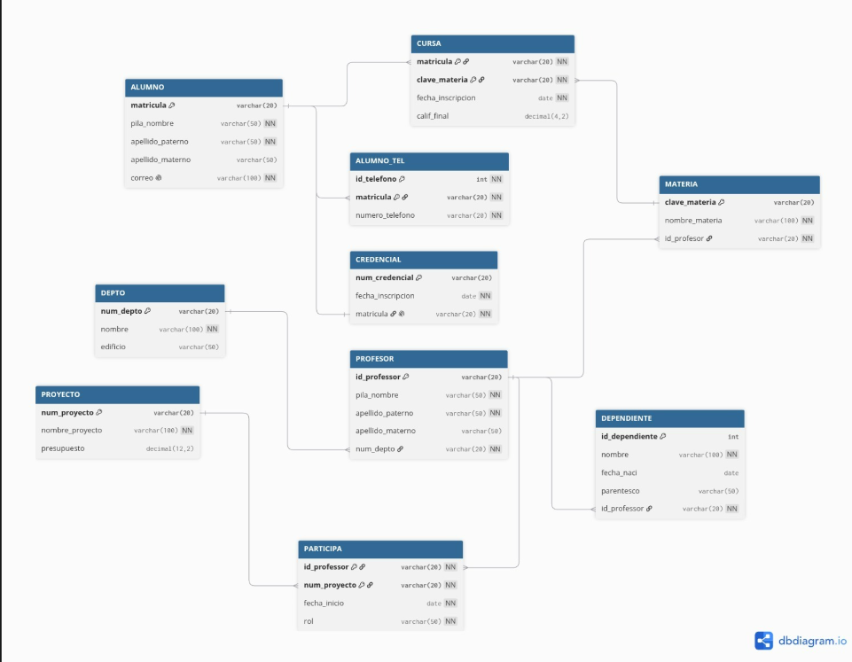

# Ejercicio de mapeo del Modelo E-R a Relacional

## Ejercicio 1

### Modelo E-R

### Modelo Relacional

 

## Ejercicio 2

 ### Modelo E-R

### Modelo Relacional

 )

 ## Ejercicio 3

 ### Modelo E-R

### Modelo Relacional

 

 ## Ejercicio 4

 ### Modelo E-R

### Modelo Relacional

 

 ## Ejercicio 5

 ### Modelo E-R

### Modelo Relacional

.jpeg)

.png)

 ## Ejercicio 6

 ### Modelo E-R

### Modelo Relacional

 

 