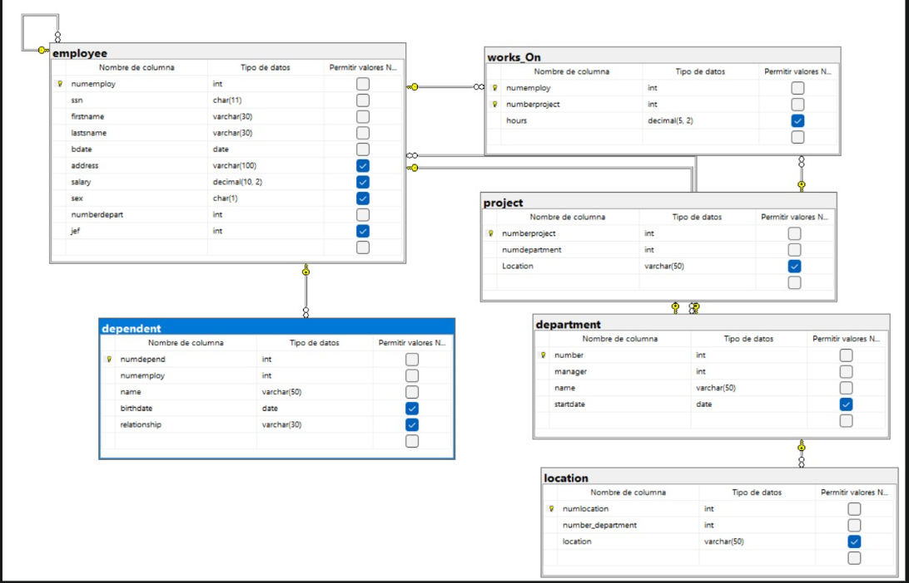

```sql
/*============ CREAR BASE DE DATOS ==============*/
CREATE DATABASE GestionEmpresa;
GO

USE GestionEmpresa;
GO


/*============ CREAR TABLA EMPLOYEE ==============*/
CREATE TABLE employee(
    numemploy INT NOT NULL,
    ssn CHAR(11) NOT NULL,
    firstname VARCHAR(30) NOT NULL,
    lastsname VARCHAR(30) NOT NULL,
    bdate DATE NOT NULL,
    address VARCHAR(100),
    salary DECIMAL(10,2),
    sex CHAR(1),
    numberdepart INT NOT NULL,
    jef INT,

    CONSTRAINT pk_employee
    PRIMARY KEY (numemploy),

    CONSTRAINT uq_employee_ssn
    UNIQUE (ssn)
);
GO

/*============ CREAR TABLA DEPARTMENT ==============*/
CREATE TABLE department(
    number INT NOT NULL,
    manager INT NOT NULL,
    name VARCHAR(50) NOT NULL,
    startdate DATE,

    CONSTRAINT pk_department
    PRIMARY KEY (number)
);
GO


/*============ CREAR TABLA PROJECT ==============*/
CREATE TABLE project(
    numberproject INT NOT NULL,
    numdepartment INT NOT NULL,
    Location VARCHAR(50),

    CONSTRAINT pk_project
    PRIMARY KEY (numberproject)
);
GO

/*============ CREAR TABLA LOCATION ==============*/
CREATE TABLE location(
    numlocation INT NOT NULL,
    number_department INT NOT NULL,
    location VARCHAR(50),

    CONSTRAINT pk_location
    PRIMARY KEY (numlocation)
);
GO

/*============ CREAR TABLA WORKS_ON ==============*/
CREATE TABLE works_On(
    numemploy INT NOT NULL,
    numberproject INT NOT NULL,
    hours DECIMAL(5,2),

    CONSTRAINT pk_workson
    PRIMARY KEY (numemploy, numberproject)
);
GO

/*============ CREAR TABLA DEPENDENT ==============*/
CREATE TABLE dependent(
    numdepend INT NOT NULL,
    numemploy INT NOT NULL,
    name VARCHAR(50) NOT NULL,
    birthdate DATE,
    relationship VARCHAR(30),

    CONSTRAINT pk_dependent
    PRIMARY KEY (numdepend)
);
GO

/*============ FOREIGN KEY EMPLOYEE -> DEPARTMENT ==============*/
ALTER TABLE employee
ADD CONSTRAINT fk_employee_department
FOREIGN KEY (numberdepart)
REFERENCES department(number);
GO

/*============ FOREIGN KEY EMPLOYEE -> EMPLOYEE (JEFE) ==============*/
ALTER TABLE employee
ADD CONSTRAINT fk_employee_jef
FOREIGN KEY (jef)
REFERENCES employee(numemploy);
GO

/*============ FOREIGN KEY DEPARTMENT -> EMPLOYEE ==============*/
ALTER TABLE department
ADD CONSTRAINT fk_department_manager
FOREIGN KEY (manager)
REFERENCES employee(numemploy);
GO

/*============ FOREIGN KEY PROJECT -> DEPARTMENT ==============*/
ALTER TABLE project
ADD CONSTRAINT fk_project_department
FOREIGN KEY (numdepartment)
REFERENCES department(number);
GO

/*============ FOREIGN KEY LOCATION -> DEPARTMENT ==============*/
ALTER TABLE location
ADD CONSTRAINT fk_location_department
FOREIGN KEY (number_department)
REFERENCES department(number);
GO

/*============ FOREIGN KEY WORKS_ON -> EMPLOYEE ==============*/
ALTER TABLE works_On
ADD CONSTRAINT fk_workson_employee
FOREIGN KEY (numemploy)
REFERENCES employee(numemploy);
GO

/*============ FOREIGN KEY WORKS_ON -> PROJECT ==============*/
ALTER TABLE works_On
ADD CONSTRAINT fk_workson_project
FOREIGN KEY (numberproject)
REFERENCES project(numberproject);
GO

/*============ FOREIGN KEY DEPENDENT -> EMPLOYEE ==============*/
ALTER TABLE dependent
ADD CONSTRAINT fk_dependent_employee
FOREIGN KEY (numemploy)
REFERENCES employee(numemploy);
GO
```
